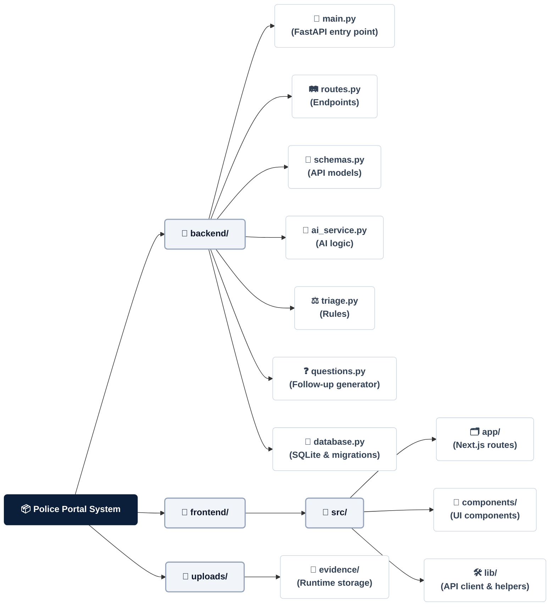
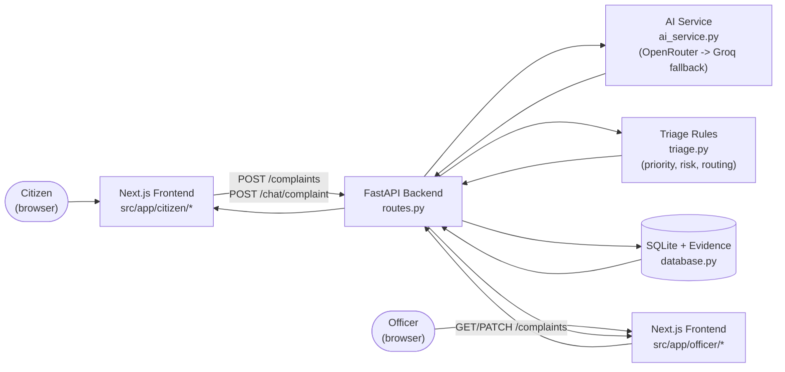
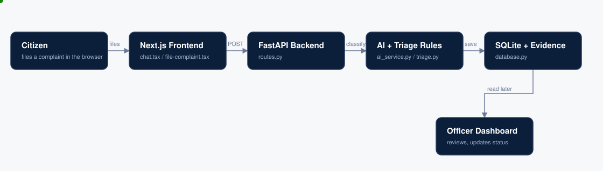
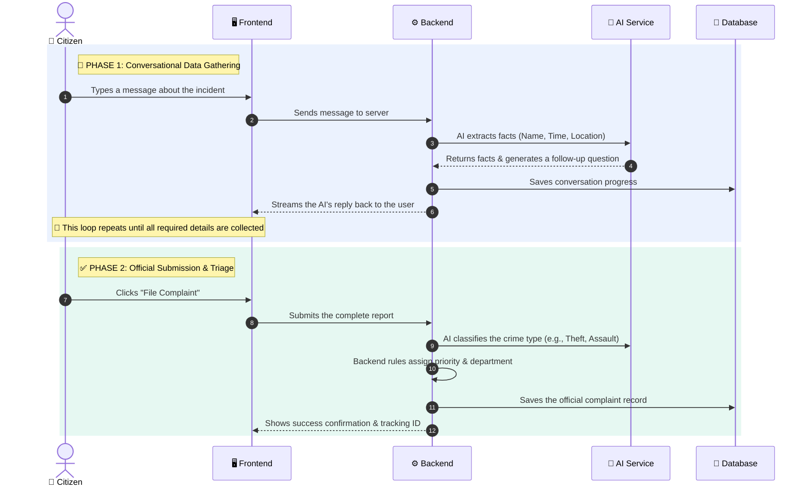

 

<p align="center">
  
</p>

<p align="center">
  
  
  
  
  
</p>

An AI-assisted police complaint intake and triage portal. Citizens can file and track complaints, upload evidence, and review follow-up questions. Officers can review complaints, filter the triage queue, update case status and notes, and download evidence.

A full, beginner-friendly, line-by-line walkthrough of this entire codebase lives in [`docs/guide/`](docs/guide/README.md).

## Tech stack

- Frontend: Next.js, React, TypeScript, Tailwind CSS, shadcn/ui
- Backend: FastAPI and Pydantic
- AI: LangChain with OpenRouter, with optional Groq fallback
- Triage: explainable Python rules in `backend/triage.py`
- Storage: SQLite plus local evidence files under `uploads/evidence/`

## Project structure


```mermaid
flowchart LR
    Root["📦 Police Portal System"] 
  
    Root --> Backend["📁 backend/"]
    Root --> Frontend["📁 frontend/"]
    Root --> Uploads["📁 uploads/"]

    Backend --> B1["🐍 main.py\n(FastAPI entry point)"]
    Backend --> B2["🛤️ routes.py\n(Endpoints)"]
    Backend --> B3["📝 schemas.py\n(API models)"]
    Backend --> B4["🤖 ai_service.py\n(AI logic)"]
    Backend --> B5["⚖️ triage.py\n(Rules)"]
    Backend --> B6["❓ questions.py\n(Follow-up generator)"]
    Backend --> B7["💾 database.py\n(SQLite & migrations)"]

    Frontend --> F_SRC["📂 src/"]
    F_SRC --> F1["🗂️ app/\n(Next.js routes)"]
    F_SRC --> F2["🧩 components/\n(UI components)"]
    F_SRC --> F3["🛠️ lib/\n(API client & helpers)"]

    Uploads --> U1["📂 evidence/\n(Runtime storage)"]

    classDef root fill:#0B1F3A,stroke:#0B1F3A,stroke-width:2px,color:#ffffff,font-weight:bold,rx:5px,ry:5px;
    classDef folder fill:#f1f5f9,stroke:#94a3b8,stroke-width:2px,color:#0f172a,font-weight:bold,rx:5px,ry:5px;
    classDef file fill:#ffffff,stroke:#cbd5e1,stroke-width:1px,color:#334155,rx:5px,ry:5px;
  
    class Root root;
    class Backend,Frontend,Uploads,F_SRC folder;
    class B1,B2,B3,B4,B5,B6,B7,F1,F2,F3,U1 file;
```

## Architecture


```mermaid
flowchart LR
    Citizen(["Citizen\n(browser)"]) --> Frontend["Next.js Frontend\nsrc/app/citizen/*"]
    Officer(["Officer\n(browser)"]) --> Frontend2["Next.js Frontend\nsrc/app/officer/*"]

    Frontend -->|"POST /complaints\nPOST /chat/complaint"| Backend["FastAPI Backend\nroutes.py"]
    Frontend2 -->|"GET/PATCH /complaints"| Backend

    Backend --> AI["AI Service\nai_service.py\n(OpenRouter -> Groq fallback)"]
    Backend --> Triage["Triage Rules\ntriage.py\n(priority, risk, routing)"]
    Backend --> DB[("SQLite + Evidence\ndatabase.py")]

    AI --> Backend
    Triage --> Backend
    DB --> Backend
    Backend --> Frontend
    Backend --> Frontend2
```

The diagram is intentionally a hybrid: the AI service only classifies and drafts text, while `triage.py`'s explainable, hand-written rules make the actual priority and routing decision. Neither the frontend nor the AI is ever the sole source of truth for a complaint's status — that's always `database.py`.

Here's the same idea as one complaint actually moves through the system, start to finish:

<p align="center">
  
</p>

## Setup

Create and activate a Python environment, then install backend dependencies:

```bash
python -m venv venv
source venv/bin/activate
pip install -r requirements.txt
```

Create the root environment file and add an OpenRouter key:

```bash
cp .env.example .env
```

```dotenv
OPENROUTER_API_KEY=your_openrouter_api_key
GROQ_API_KEY=your_optional_groq_api_key
```

Install frontend dependencies:

```bash
cd frontend
npm install
```

The frontend reads `NEXT_PUBLIC_API_URL` and defaults to `http://localhost:8000` when it is not set.

## Run locally

Start the backend from the repository root:

```bash
uvicorn backend.main:app --reload
```

The API runs at `http://localhost:8000`; interactive API documentation is available at `http://localhost:8000/docs`.

In a second terminal, start the frontend:

```bash
cd frontend
npm run dev
```

The web application runs at `http://localhost:3000`.

## Application routes

- `/citizen/file-complaint` - submit a complaint and upload evidence
- `/citizen/track-complaint` - retrieve a complaint by its ID
- `/officer/dashboard` - search and filter the triage queue
- `/officer/complaints/[id]` - review and update a complaint
- `/officer/evidence-review` - review uploaded evidence

## API endpoints

- `POST /complaints` - analyze and create a complaint
- `GET /complaints` - list complaints
- `GET /complaints/{id}` - retrieve one complaint
- `PATCH /complaints/{id}/triage` - update status and officer notes
- `POST /complaints/{id}/evidence` - upload evidence
- `GET /complaints/{id}/evidence` - list evidence metadata
- `GET /evidence/{id}` - download an evidence file

Evidence uploads accept JPG, JPEG, PNG, PDF, and TXT files up to 10 MB per file. SQLite tables and missing columns are initialized automatically when the backend starts.

## Filing a complaint through chat, step by step


```mermaid
sequenceDiagram
    autonumber
    actor C as 👤 Citizen
    participant F as 🖥️ Frontend
    participant B as ⚙️ Backend
    participant A as 🤖 AI Service
    participant D as 💾 Database

    rect rgba(59, 130, 246, 0.1)
        Note right of C: 💬 PHASE 1: Conversational Data Gathering
        C->>F: Types a message about the incident
        F->>B: Sends message to server
        B->>A: AI extracts facts (Name, Time, Location)
        A-->>B: Returns facts & generates a follow-up question
        B->>D: Saves conversation progress
        B-->>F: Streams the AI's reply back to the user
        Note over C, F: 🔄 This loop repeats until all required details are collected
    end

    rect rgba(16, 185, 129, 0.1)
        Note right of C: ✅ PHASE 2: Official Submission & Triage
        C->>F: Clicks "File Complaint"
        F->>B: Submits the complete report
        B->>A: AI classifies the crime type (e.g., Theft, Assault)
        B->>B: Backend rules assign priority & department
        B->>D: Saves the official complaint record
        B-->>F: Shows success confirmation & tracking ID
    end
```

The full, file-by-file version of this exact trace, including every function name involved, is [Chapter 5.2 of the guide](docs/guide/24-connecting-full-trace.md).

## Verification

```bash
python -m py_compile backend/*.py
cd frontend
npm run lint
npm run build
```
